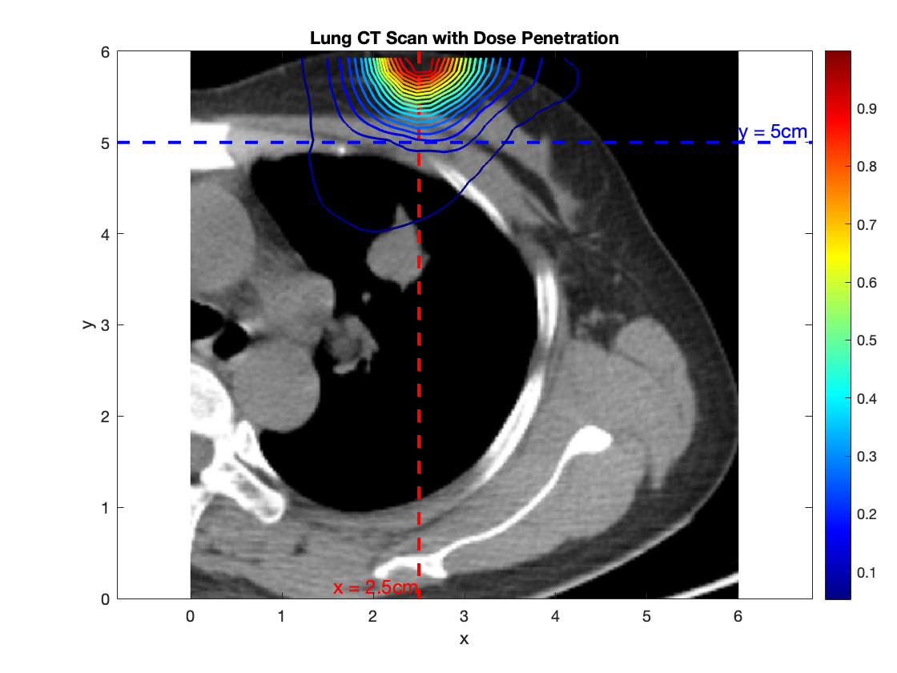

# StarMAP Medical 
A second order staggered grid finite difference solver for linear
hyperbolic moment approximations to the equations of radiative
transfer in 1D, 2D and 3D geometry. This version is tailored particularly for radiative transfer computations using the continuous-slowing down approximation to the PN equations. 

Version 1.0-med

Copyright (c) 09/29/2024 [Benjamin Seibold](http://www.math.temple.edu/~seibold), [Martin Frank](https://www.scc.kit.edu/personen/martin.frank.php), and
                         [Rujeko Chinomona](https://rujekoc.github.io/)
                         

Contributers: Edgar Olbrant (v1.0), Kerstin Kuepper (v1.5, v2.0, v1.0-med), Pia Stammer (v1.0-med)

StaRMAP project website:
https://github.com/starmap-project

Prior versions of StaRMAP:
http://math.temple.edu/~seibold/research/starmap/

## Examples implemented
1. 1D Water Phantom : `starmap_create_water_phantom.m` and `starmap_1d_ex_water_phantom.m`
2. 2D Lung CT scan test :`starmap_create_lung_cttest.m` and `starmap_2d_ex_lung_cttest.m`
    2D Lung CT scan with dose contours computed by the StarMAP solver overlaid
   

## Operation
Details of each test can be modified in the example generator files `starmap_create*`, running the example file then calls the StaRMAP solver. 
For further details pertaining to StarMAP, please see the [main project repository](https://github.com/starmap-project/starmap/).

